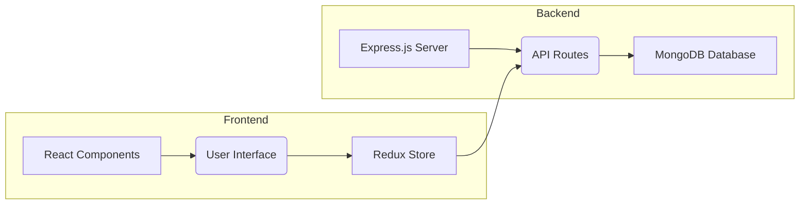
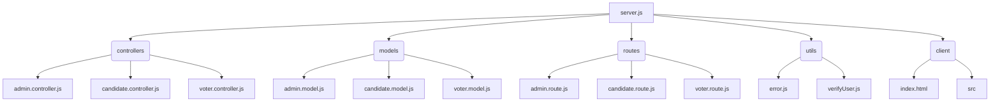

# Smart-Ballot

> A full-stack web application for secure and transparent online voting.  This application allows voters to cast their votes securely and provides administrators with tools to manage candidates and elections.

## 📚 Table of Contents

- [Description](#description)
- [Tech Stack](#tech-stack)
- [Architecture Overview](#architecture-overview)
- [File Structure](#file-structure)
- [Features](#features)
- [Installation](#installation)
  - [Prerequisites](#prerequisites)
  - [Setup](#setup)
- [Usage](#usage)
  - [Execution Options](#execution-options)
- [Contributing](#contributing)
- [Contributors](#contributors)
- [License](#license)
- [Credits](#credits)


## Description

Smart-Ballot is a full-stack web application designed for secure online voting.  The backend, built with Node.js and Express.js, manages user authentication, candidate information, and vote tallies using a MongoDB database. The frontend, developed with React, provides a user-friendly interface for voters to register, login, and cast their votes.  The application features separate dashboards for voters and administrators, allowing for secure access control and efficient election management.  Key features include user authentication with JWTs, secure vote storage, and robust error handling.

## Tech Stack

[](https://nodejs.org/) [](https://expressjs.com/) [](https://reactjs.org/) [](https://www.mongodb.com/) [](https://html.spec.whatwg.org/) [](https://www.w3.org/Style/CSS/) [](https://tailwindcss.com/) [](https://developer.mozilla.org/en-US/docs/Web/JavaScript) [](https://mongoosejs.com/) [](https://www.npmjs.com/package/bcrypt) [](https://www.npmjs.com/package/jsonwebtoken) [](https://firebase.google.com/) [](https://redux.js.org/)  [](https://github.com/PIYUSH1SAINI/ReadMe-wiz.git)


## Architecture Overview



## File Structure



## Features

- Secure user authentication and authorization using JWTs.
- Separate dashboards for voters and administrators with role-based access control.
- Secure vote storage and tallying mechanisms to prevent fraud.
- Real-time updates for vote counts (on the admin dashboard).
- User-friendly interface for easy navigation and voting.
- Comprehensive error handling and feedback mechanisms.

## Installation

### Prerequisites

> [!NOTE]
> Node.js >=14, npm, and MongoDB are required.  Ensure MongoDB is running before proceeding.

### Setup

1. **Clone Repository**: Clone the repository from GitHub and install dependencies.

   ```bash
   git clone https://github.com/raghavG0212/Smart-Ballot.git
   cd Smart-Ballot
   npm install
   ```

2. **Database Setup**: Create a MongoDB database and adjust the connection string in `database/connectDB.js`.


> [!TIP]
> Use the `git clone` method above for quick setup.


## Usage

### Execution Options

1. **Backend Execution:** Start the backend server.

   ```bash
   npm run start
   ```

2. **Frontend Execution:** Start the frontend development server.

   ```bash
   npm run client
   ```

> [!IMPORTANT]
> Run both the backend and frontend servers concurrently using `npm run happy_voting` for a complete application experience.


## Contributing

Contributions are welcome! Please open issues or submit pull requests on GitHub.


## Contributors

<a href="https://github.com/raghavG0212" target="_blank"></a>


## License

ISC License


## Credits

RAGHAVGOEL

Node.js, Express.js, React, MongoDB, Bcrypt, jsonwebtoken, Mongoose, Firebase, Redux


<a href="https://github.com/PIYUSH1SAINI/ReadMe-wiz.git" target="_blank">
      
    </a>
